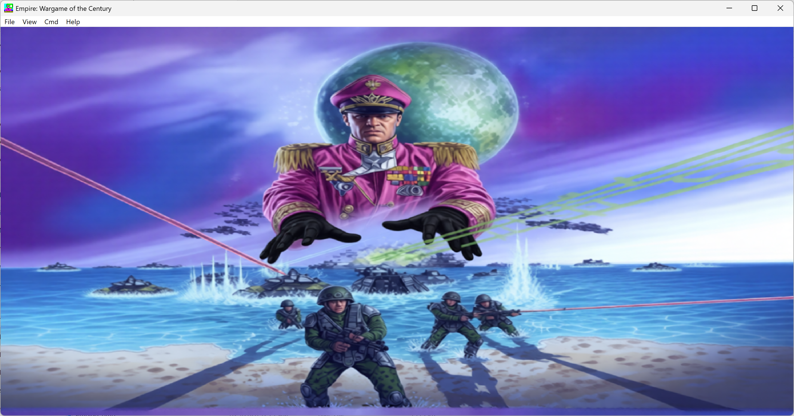
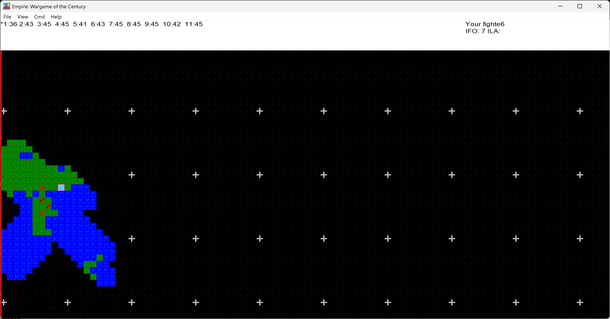

# Empire: Wargame of the Century

**The granddaddy of turn-based strategy games.**

A classic grand strategy wargame created by Walter Bright in 1977, now rebuilt as a single self-contained Windows executable. No installers, no loose files -- just `empire.exe`.

**[Download latest release](https://sp00.nz/releases/empire/)**

---

> **Disclaimer:** This is an unofficial fan project for noncommercial, personal use only. It is not affiliated with, endorsed by, or connected to Walter Bright, Digital Mars, or any rights holder. All original game content remains the property of its creator.

---





---

## About the Game

Empire is a turn-based strategy game of military conquest. You start with a single city on a randomly generated world map shrouded in fog of war. Produce armies, fighters, and naval units. Explore the unknown. Capture enemy cities. Destroy all opposition.

### Unit Types

| Unit | Symbol | Speed | Role |
|------|--------|-------|------|
| Army | A | 1 | Captures cities, the backbone of your force |
| Fighter | F | 4 | Fast air recon, limited fuel range |
| Destroyer | D | 2 | Fast naval patrol, anti-submarine |
| Transport | T | 2 | Carries armies across water |
| Submarine | S | 2 | Stealthy naval attack |
| Cruiser | R | 2 | Shore bombardment |
| Carrier | C | 2 | Mobile airfield for fighters |
| Battleship | B | 2 | Heavy naval firepower |

---

## History

Empire has a remarkable history spanning nearly five decades, from a plywood board game to one of the most influential computer strategy games ever made.

### 1971 -- The Board Game

Walter Bright, age 11, built the first version of Empire as a physical board game on a 4-by-8-foot sheet of plywood. Inspired by Risk, Stratego, and the 1969 film *Battle of Britain*, he painted a grid map and manufactured custom playing pieces. The game worked, but was tedious to play by hand.

### 1977 -- The Computer Version

At Caltech, Bright realized a computer could *"remove the tedium and leave the fun part."* He wrote Empire in FORTRAN for the PDP-10 mainframe, with a 60x100 map designed for hardcopy terminal output at 300 baud. The game spread virally across PDP-10 systems. It was so addictive that some Caltech students failed their classes playing it.

Empire pioneered **fog of war** in computer games -- a mechanic Bright drew from Stratego and the Battle of Midway, where intelligence decided the outcome. Only the area around your units is visible; everything else is black. This was impossible in the board game version, but trivial for a computer to enforce.

### 1984 -- The IBM PC

Bright recoded Empire in C for the IBM PC. He submitted a small announcement to BYTE Magazine's "Software Received" section expecting nothing. Instead, orders flooded in. He sat on his living room floor sorting xeroxed manuals, copying disks, and stapling them into envelopes.

### 1987 -- Wargame of the Century

Interstel Corporation published the commercial release, co-authored with Mark Baldwin. *Empire: Wargame of the Century* shipped on MS-DOS, Amiga, Atari ST, Commodore 64, Apple II, and Macintosh. *Computer Gaming World* named it **1988 Game of the Year**, inducted it into their **Hall of Fame** in 1989, and in 1996 ranked it the **8th best computer game ever released**.

CGW called it *"a fascinating grand strategic wargame, more sophisticated than Risk, but easier to play than Third Reich."*

### Influence

Empire is a direct inspiration for Sid Meier's *Civilization* (1991). Its fog-of-war exploration, city-based production, and conquest gameplay established the template for what became the **4X genre** (explore, expand, exploit, exterminate).

Walter Bright's work optimizing Empire also led him into compiler development, ultimately resulting in the **D programming language** -- the same language this version is written in.

---

## Building

Everything -- bitmaps, sounds, icons, dialogs -- is compiled into a single `empire.exe`. No asset folders needed at runtime.

### Prerequisites

- [LDC2](https://github.com/ldc-developers/ldc/releases) (LLVM-based D compiler, includes DUB)
- Windows SDK (for `rc.exe` resource compiler)

### Build

```
build.bat
```

This compiles all BMP and WAV assets into Windows resources, then builds `empire.exe`.

For a release build:

```
build.bat release
```

### What Gets Embedded

The build process packages everything into the executable:

- 64 bitmap sprites (units, terrain, cities for all teams)
- 14 sound effects (gunfire, explosions, engine sounds)
- Splash screen, cursor, blast effects
- Window icon, menus, and dialogs
- High-DPI manifest for Windows 11

---

## Controls

| Key | Action |
|-----|--------|
| Arrow keys | Move selected unit |
| P | Set city production |
| G | Go to city |
| S | Set unit to sentry |
| K | Wake up unit |
| F | From-To movement |
| I | Set direction |
| R | Random movement |
| L | Load army/fighter |
| U | Unload army/fighter |
| H | 20 free moves |
| Y | Survey |
| N | Center screen |
| O | Change point of view |
| +/- | Zoom in/out |
| Esc | Cancel current mode |

---

## Credits

Original game created by **Walter Bright**, 1977--2004.

This fan port to D2/LDC2 for Windows 11 is an independent, noncommercial project with no affiliation to Walter Bright or Digital Mars. It exists purely out of love for a game that shaped an entire genre.

*Copyright (C) 1978-2004 by Walter Bright. All Rights Reserved.*
*Personal use only. Contact www.digitalmars.com for commercial licensing.*
